# LRU Hash Table Analysis Report

## 1. Dataset Summary

- Profile: lru_profile
- Trace files: 11 (N = 1024 to 1048576)
- Probe types tested: single, double
- Compaction: enabled (trigger = 0.95)
- Total data points: 22

## 2. Section 5.1: Timing Analysis

### 5.1.1 Expectations vs Observations

**Expected:**
My initial expectations are that double probing would be worse 
than single probing at small N. The extra computation required for
double probing seems like it would be more overhead than the benefit
of double probing. (Essentially, extra probing might happen with single probing
but still less overhead at small N).

At some point, I expect double probing to actually be worth it. So at large N I absolutely
expect double probing to outperform single probing (but what N will be interesting
to find out). This is due to double probing has a little more overhead, 
but less overall probes, I expect it to be faster. Since I fully expect double probing to overtake
single probing, at some point the data should intersect. I expect this intersection to occur at some
large N, likely somewhere near the middle of our actual data set (perhaps around 2^16).

**Observed:**
**Separation analysis across N:**

At small N (1024):
- Single: 25.155 ms
- Double: 32.942 ms
- Gap: 7.787 ms (31% slower for double)

At medium N (32768):
- Single: 1,811 ms
- Double: 2,038 ms
- Gap: 227 ms (13% slower for double)

At large N (1048576):
- Single: 29,319 ms
- Double: 40,258 ms
- Gap: 10,939 ms (37% slower for double)

**Note:** The percentage gap does not consistently widen or narrow—it
varies between 13-37% across N values. However, the absolute gap grows dramatically
(7.8 ms → 10,939 ms), scaling roughly linearly with N. This suggests constant
per-operation factors dominate, not N-dependent effects.

The data actually dramatically disagreed with my expectation! At least for a elapsed ms,
I thought that EVENTUALLY double probing would be better, but single probing was consistently
faster across all N. 

The N value where separation is largest is at N = 2^20 (the largest N we tested-which
makes me wonder if as N increases, so does the separation between single and double probing),
and the separation ratio is: 29,319/40,258 which is about 72%. That is, single probing takes
about 72% as long vs double probing (28% faster).

**The Missing Crossover:**

My initial hypothesis included a crossover at some N because I thought that eventually double probing 
would overcome the hashing overhead compared to single probing. However, this never ocurred, and there are 
two potential reasons for this:

- Double probing simply beats out single probing at some larger N than was tested.
- There is no N where double probing beats single probing for our hashing implementation.

I believe the latter is the case when considering the data of elapsed time above. The reason for this is
that single probing was faster for all N tested. This is likely caused by how expensive it is to hash 
strings, and double probing is doing that twice as often as single probing.

### 5.1.2 Work per Operation vs Wall-Clock Time

**Average probes comparison:**

The average probes for a double probe was approximately 6.5 across all N tested. However,
the single probes had faster elapsed times across all N tested. This tells me that the 
hashing costs of the double probing lost to caching. Furthermore, since average probes
of double probing was consistent, as well as the separation growing as N increased, 
if we were to continue to increase N, I would expect single probing to continue to outperform
double probing.

The ordering by average_probes and by time actually ALWAYS disagreed. Despite double probing
having less average probes **ALWAYS** it still performed slower than single probing. This is likely
due to the overhead of a second hashing function as well as single probing taking
advantage of caching. The compactions count is also higher for double probing across 
all N tested, which certainly contributes to overhead and the slower elapsed time.

### 5.1.3 Hashing Cost and Memory Locality
The per operation hashing costs differ in that, while single probing simply moves on to the 
next slot in the array, double probing must do ANOTHER hashing function and then jump around. As stated
earlier, caching is an advantage of single probing, and matters more and more as N increases. The reason
for this is that double probing jumps around which does not utilize caching very efficiently. However, for
small N, double probing can still take advantage of caching to some extent, and that is why
double probing starts close to single probing but then diverges from it as N increases. That is, the constant
factors matter the most at large N.

Another point of struggle for the double probing algorithm is that we are hashing strings, which
is expensive. For every expensive hashing operation that single probing does, double probing does 
two of them.

### 5.1.4 Compaction Effects (indirect inference)

.png)

Per the chart above, across all N tested, double probing triggered more compactions than single probing. At N = 1024 (smallest N
tested), for example, double probing triggered 32 compactions while single probing triggered 26. That is a 23%
increase in compactions.
Interestingly enough, double probing triggered exactly 6 more compactions than single probing for all N tested.

As described in the above chart, as well as the elapsed_ms chart in 5.1.1 shows, 
double probing always had more compactions and *always* took longer for all N tested.
Given that there is a constant difference in compactions (6), I am not sure that it has
anything to do with the actual probing algorithm. I believe the reason for this constant difference
is that each hash function (single vs double probing) is using the same trace files and compacting at the 
same time (95 % trigger). This could explain why as N changes, the difference in compactions is constant.

### 5.1.5 Throughput and Latency cross-check

#### Definition of Throughput:
Throughput (ops/ms) = ops_total / elapsed_ms 
This emphasizes 'how much got done per millisecond'

#### Definition of Latency:
Latency (ms/op) = elapsed_ms / ops_total
This emphasizes 'how long one op takes on average'

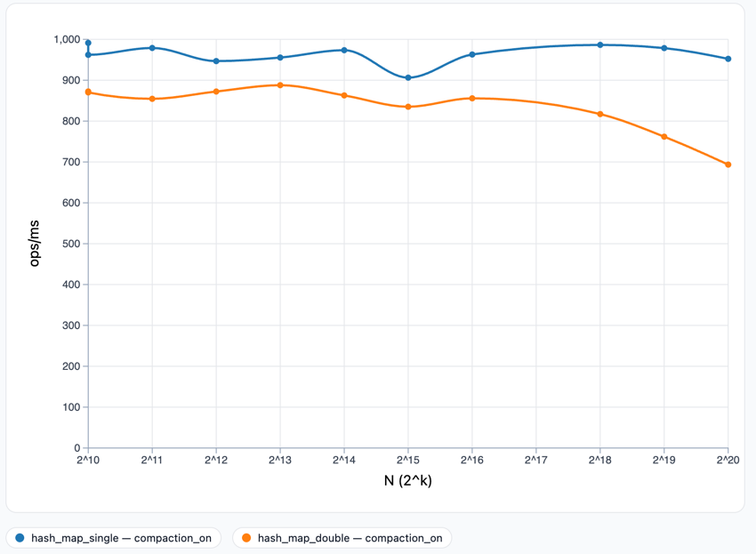

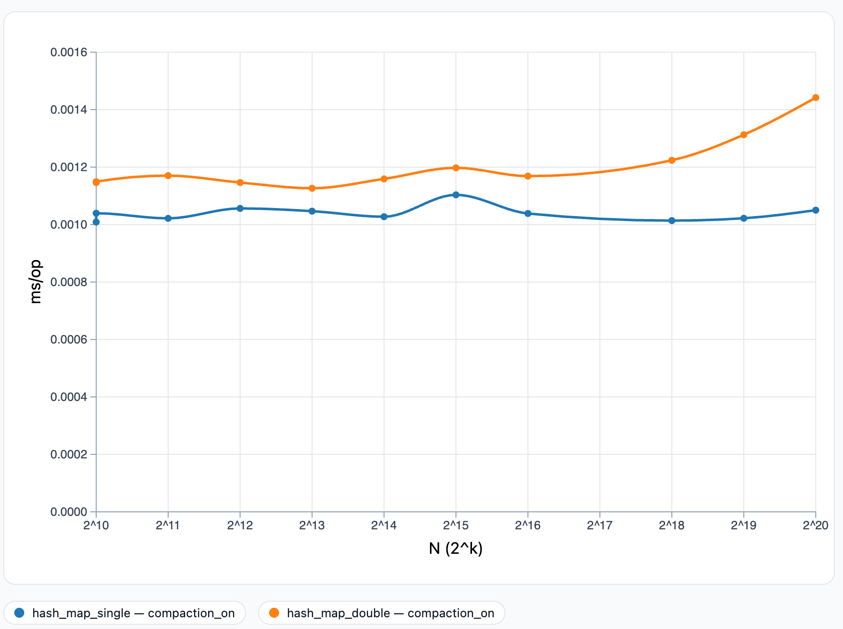

Per the above charts, single probing consistently has higher throughput, as well as having a 
lower latency across all N tested. This is consistent with the elapsed_ms chart in 5.1.1,
because double probing took longer for each N. More specifically, for N = 2^20,
double probing had an average latency of 0.001442 ms/op. while single probing had an average
latency of 0.001050 ms/op. This means that at the largest difference in latency, single probing was 
approximately 28% faster than double probing. 

While this is consistent with the elapsed time chart in 5.1.1. If I had to choose an N that 
diverges for the throughput or latency, I would choose smaller N, because despite the throughput
being higher still for single probing, the difference between double probing and single probing
is much closer than any other value N. 

With proper understanding of what each of these metrics mean, they essentially tell us the same thing.
However, I believe latency to be more intuitive when explaining the algorithmic differences. I want to 
reiterate that throughput does identify which was better, especially for those that understand the concept 
of throughput. The idea of 'how long it takes per operation on average' is very intuitive and easy to 
understand. As we can see in the above charts, single probing had significantly less latency than double probing, 
and it seemed to only grow as N did after about N = 2^16. 

The reason for this likely goes back to the observation in 5.1.1, that the hashing cost of our implementation 
is simply too high for double probing to outperform single probing.

### 5.1.6 Occupancy Overlay Sanity Check

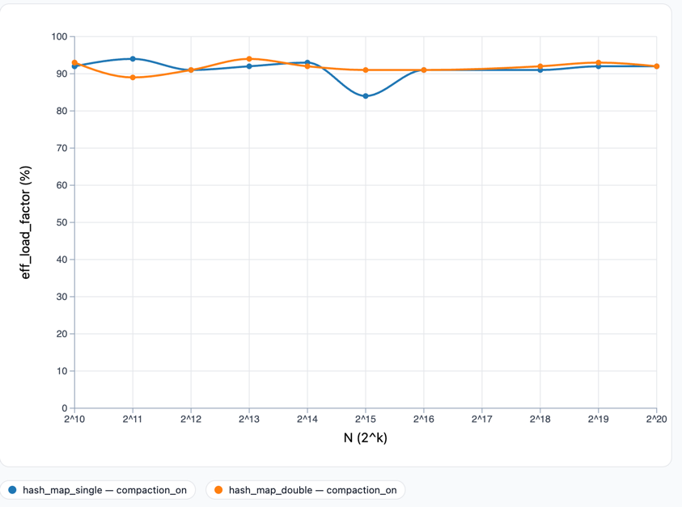

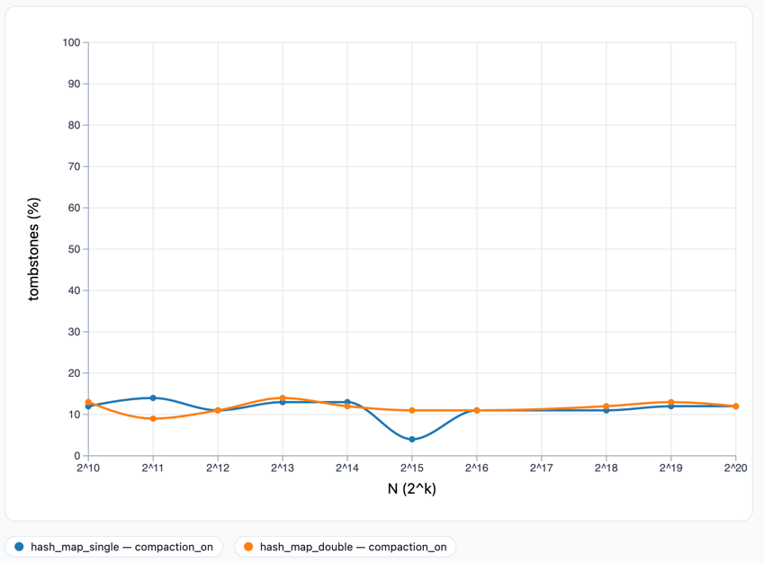

#### Definitions
load_factor_pct = ACTIVE/M
tombstones_pct = DELETED/M

available_pct = 100 - load_factor_pct - tombstone_pct
eff_load_factor_pct = ACTIVE/(M - DELETED) -- This is the load you *feel* while probing

#### N = 1024
##### load_factor_pct
- Single probing: 80%

- Double probing: 80%

##### eff_load_factor_pct
- Single probing: 92%

- Double probing: 93%
##### tombstones_pct
- Single probing: 12%

- Double probing: 13%

#### N = 2048
##### load_factor_pct
- Single probing: 80%

- Double probing: 80%

##### eff_load_factor_pct
- Single probing: 94%

- Double probing: 89%
##### tombstones_pct
- Single probing: 91%

- Double probing: 91%

#### N = 4096
##### load_factor_pct
- Single probing: 80%

- Double probing: 80%

##### eff_load_factor_pct
- Single probing: 91%

- Double probing: 91%
##### tombstones_pct
- Single probing: 11%

- Double probing: 11%

#### N = 8192
##### load_factor_pct
- Single probing: 79%

- Double probing: 79%

##### eff_load_factor_pct
- Single probing: 92%

- Double probing: 94%
##### tombstones_pct
- Single probing: 13%

- Double probing: 14%

#### N = 16384
##### load_factor_pct
- Single probing: 80%

- Double probing: 80%

##### eff_load_factor_pct
- Single probing: 93%

- Double probing: 92%
##### tombstones_pct
- Single probing: 13%

- Double probing: 12%

#### N = 32768
##### load_factor_pct
- Single probing: 80%

- Double probing: 80%

##### eff_load_factor_pct
- Single probing: 84%

- Double probing: 91%
##### tombstones_pct
- Single probing: 4%

- Double probing: 11%

#### N = 65536
##### load_factor_pct
- Single probing: 79%

- Double probing: 79%

##### eff_load_factor_pct
- Single probing: 91%

- Double probing: 91%
##### tombstones_pct
- Single probing: 11%

- Double probing: 11%

#### N = 262144
##### load_factor_pct
- Single probing: 79%

- Double probing: 79%

##### eff_load_factor_pct
- Single probing: 92%

- Double probing: 91%
##### tombstones_pct
- Single probing: 11%

- Double probing: 12%

#### N = 524288
##### load_factor_pct
- Single probing: 80%

- Double probing: 80%

##### eff_load_factor_pct
- Single probing: 92%

- Double probing: 93% 
##### tombstones_pct
- Single probing: 12%

- Double probing: 13%

#### N = 1048576
##### load_factor_pct
- Single probing: 79%

- Double probing: 79%

##### eff_load_factor_pct
- Single probing: 92%

- Double probing: 92%
##### tombstones_pct
- Single probing: 12%

- Double probing: 12%

#### Analysis of load factor %

There was no meaningful difference between single and double probing for this specific
part. In fact, they were identical at all N! They were 80% for almost all N (the intended cap) and
occasionally ended at 79% for some N, which is completely acceptable as we are *CAPPING* the load
factor at 80%.

#### Analysis of Effective Load Factor %

Per the chart and data above within this section, we see that there are very similar
effective load factors at most N, with some notable discrepancies. At N = 32768, 
double probing had an effective load factor of 91%, while single probing had an effective
load factor of 84%. This can be explained as we analyze tombstone % below, but for the same N
double probing has 7% more tombstones than single probing.

#### Analysis of Tombstone %

As we see from the charts and trying to reconcile effective load factor above, we see
where the major differences occur. More importantly, we see *why*. Since both hash tables
are following the same input and same operation pattern, the difference comes from the tombstones
and their effect on the effective load factor.

For most N, double probing has more tombstones than single probing. This is because double 
probing will jump around more, and thus it might miss some tombstones during the Insertion
operation. Conversely, single probing continues to probe until it finds a free slot, making it 
less likely to miss a tombstone and allowing the algorithm to overwrite.

#### Choose one N where the time gap is largest. How do the occupancy percentages differ between methods there? Can you explain the gap?

The N where the time gap is the largest is N = 2^20. The largest performance gap actually ocurrs when 
occupancy metrics are identical. What this shows for our implementation is that structure does not determine 
the performance (although it still certainly helps). I believe that this finding is what definitively proves my 
explanation for 5.1.1 as to why single probing is faster than double probing.

Furthermore, as stated earlier, double probing consistently has the least probing while also having the most overhead.
Although theory states that double probing is faster than single probing, it has become clear through analyzing these charts
that theory is not everything, the underlying implementation is what matters to achieve theoretically optimal 
solutions.

### 5.1.7 Before/After Compaction Structure

#### N = 4096

Active maps:

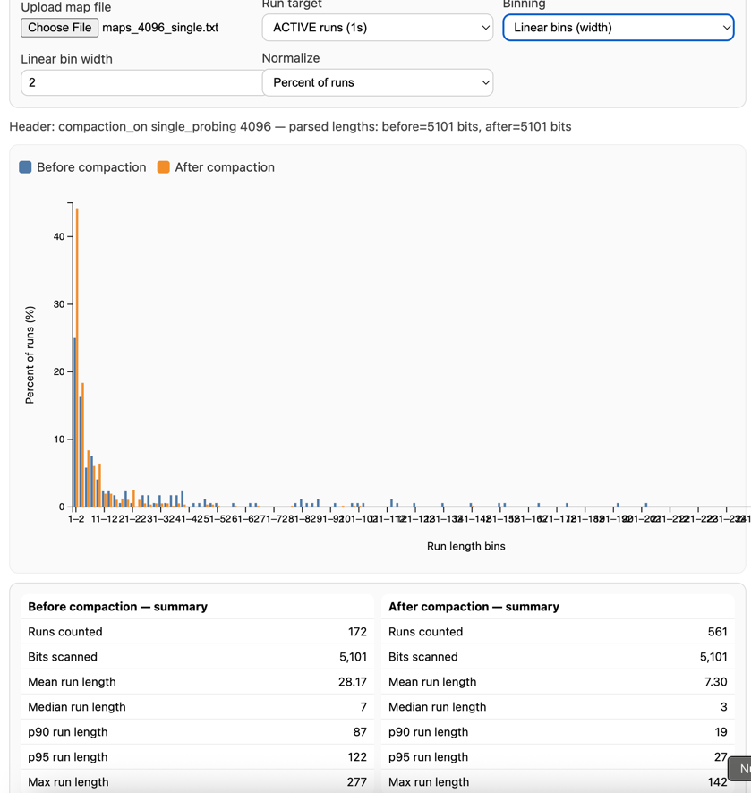

Inactive maps:

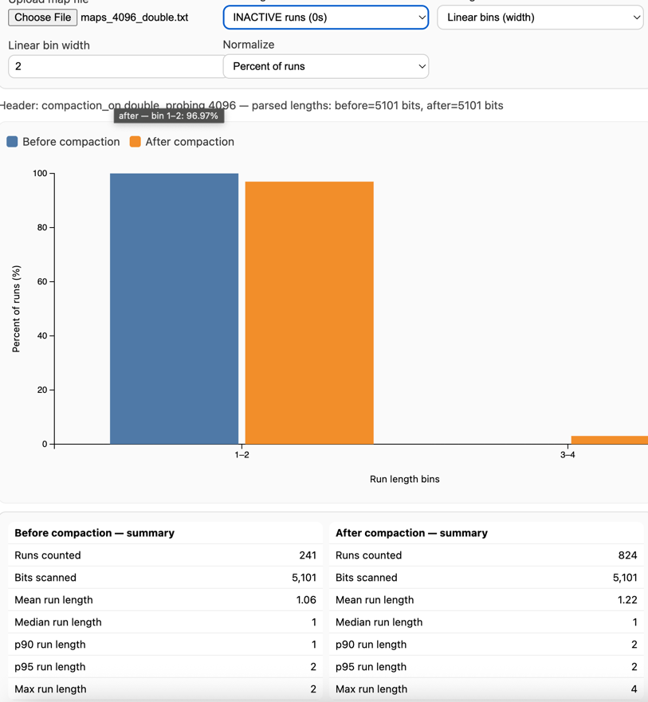
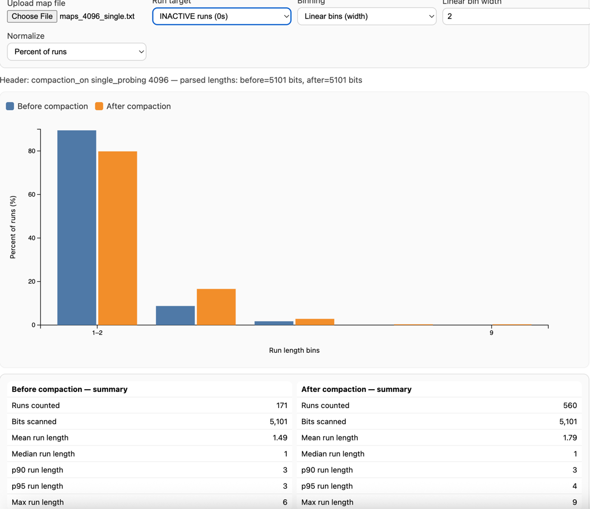

Here we can see that before compaction, for double probing, there are less than 10% of active runs are of length 1-2,
meanwhile, there are many runs of length 40+. After compaction, however, over 35% of runs are of length 1-2. Single probing behaved
similarly, however after compaction, there were many runs of length 40+ in the 1-2 bin. This is a much bigger shift for single probing
as it dramatically lowers the number of probes before we hit a slot that is empty. This would also likely benefit single probings run-time,
contributing to its faster performance for all N tested.

With the inactive map, double probing had nearly 100% of its runs in the 1-2 bin. While single probing also had a dramatically larger 
portion of inactive runs in the 1-2 bin, it also had about 15% in the 3-4 bin. After compaction, double probing still had nearly the same amount of inactive
runs in the 1-2 bin. This follows with how I would expect because double probing consistently has less probes than single probing, and even if we run 
into a slot that is taken, single probing must follow the entire run of inactivity (double probing jumps around).

#### N = 8192

Active maps:

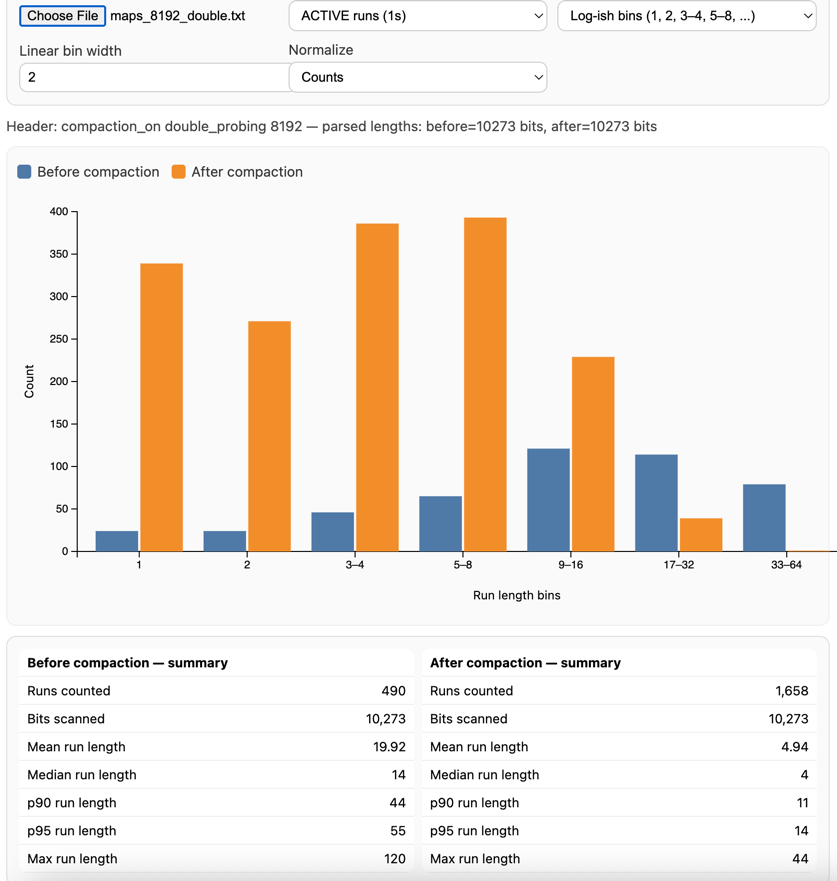
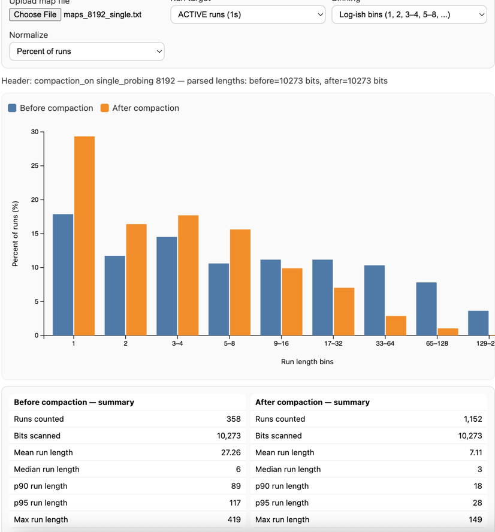

Inactive maps:

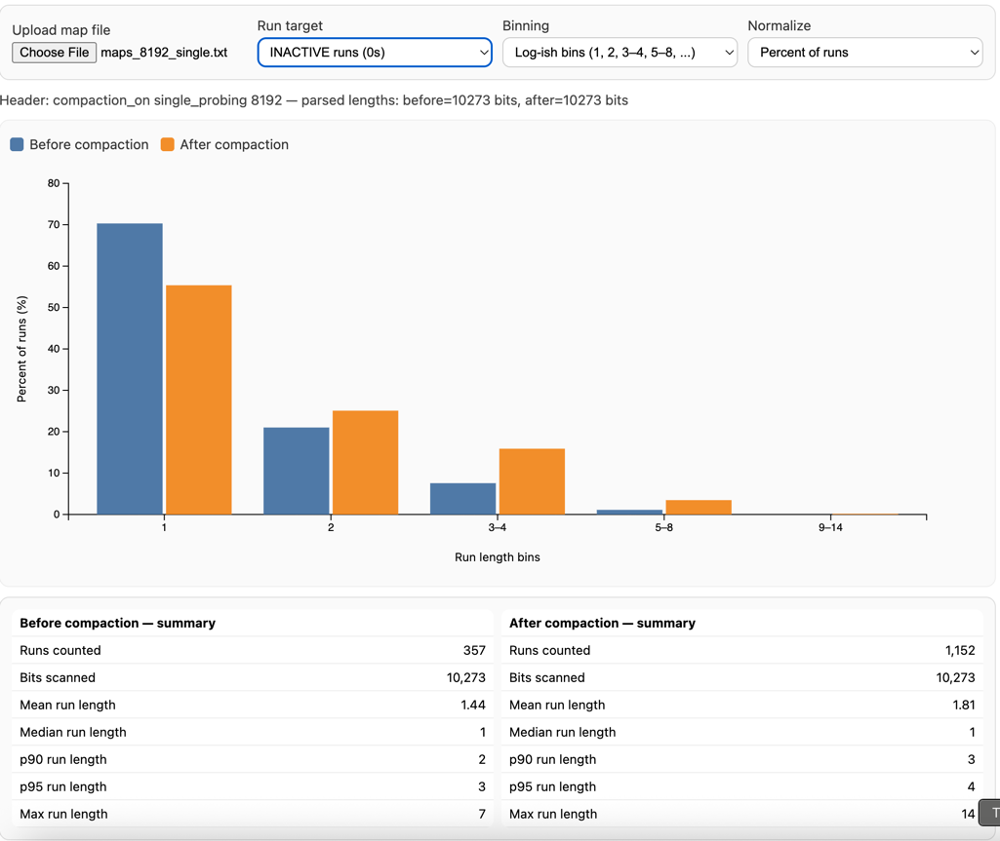

Using N = 8192 brings to light some interesting differences when compared to N = 4096 above. For double probing, the active runs 
have less than 50 (5%) of runs of size 1. This is less of an issue for double probing, however, and after compaction there 
are nearly 350 (20%) of runs of size 1. Due to the nature of single probing, active runs of size 1 are extremely advantageous,
albeit rare. Before compaction, there are around 60 runs of size 1. but after compaction, there are  nearly 350
runs of size 1 yet again! This very much helps to contribute to the overall performance of single probing outperforming double probing.

Despite these performance enhancements, single probing still always had a larger average probes count, but this is understandable in theory due to
the nature of double probing (and single probing continuously checking each slot).

## 3. Section 5.2: Maps + Histograms

### 5.2.4 Questions to answer

1) Where are the longest 1-runs in ACTIVE+DELETED—few big blocks or many medium ones?

As we see in the histogram charts in 5.1.7, the longest 1-runs always occur after compaction (obvious I know).
However, take N = 4096 for example. Before compaction, the mean run length is 20.02, implying many medium blocks.
After compaction, however, the mean goes down to 4.96! A 75% difference in average run length!

Single probing behaves similarly for N = 8192, although it was slightly less efficient in compaction. Before compaction 
the mean was 27.26 (awful overhead for single probing). After compaction, the mean was 7.11 making the average probe for single probing 
go down by just over 66%. This is obviously not as huge as 75% but pretty close (and certainly significant for our algorithm).

2) At the same N, do single and double probing show visibly different clustering?

We absolutely can see a difference in clustering between single and double probing.
For double probing, before compaction, we can see that there are much less runs of size 1 and it slowly increases
as bin length increases. Single probing, however, is pretty constant with its distribution of run sizes (until the bin gets to
over 129).

3) Does compaction break up long 1-runs in your “after” snapshot?

Yes! Long runs nearly disappear after compaction for the most part. This causes the large bins to turn into 
several smaller bins (not necessarily of size 1, but of small to medium bin sizes).

4) After compaction, do the long runs shrink? Do more runs shift into shorter lengths?

Yes! Long runs shrink significantly after compaction. This is because the removal of tombstones causes the 
length of the run to decrease.

This holds true even at the larger N values, such as 262144 pictured below.
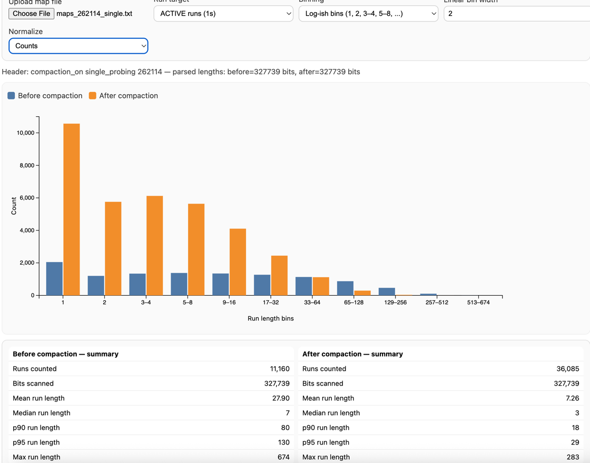

5) Single vs double at the same N: which has more long runs in ACTIVE+DELETED?

Single probing has more long runs in ACTIVE+DELETED. As we can see above for both histogram sizes,
single probing has many long runs that double probing did not even make a bin for.

6) When you see longer runs in ACTIVE+DELETED, do you also see higher average_probes and higher elapsed_ms?

As we can see in the average probes chart below, we do see higher average probes for single probing at the size 
N = 8192, especially compared to single probing for all other N. At this size, the histogram below shows 
us there are quite a few long runs of varying lengths.

Conversely, we see a pretty consistent amount of medium length runs for double probing at the same N. We see in the average
probes chart, however, points out that double probing had a consistent average of 6.5 probes (as discussed earlier in this report).

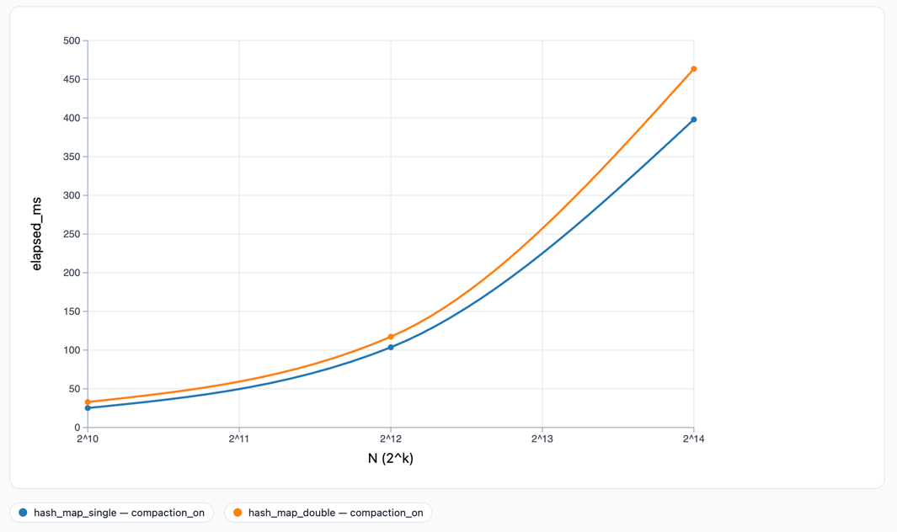

As far as elapsed_ms is concerned, it does not appear to have a significant impact for either single or double probing in these particular
cases. However, at larger N where compaction reduces long runs, the elapsed ms is almost certainly shorter than it would normally be. 
The following is a histogram for N = 262114.

While the compaction seems to have little effect on double probing, single probing is still significantly faster. The single probing chart above shows
that prior to compaction, there are quite a few long runs. After compaction, there are only small to medium runs, and over 10,000 of these
runs are of length 1.

7) When compaction reduces long runs, do average_probes and elapsed_ms improve?

At least within MY test run, I did not see a difference in compaction improving average probes.
As we see in the chart below, probing was pretty consistent for both probing styles across all N with 
the exception of N = 8192.

8) How do load_factor_pct, eff_load_factor_pct, and tombstones_pct line up with what you see in the maps and histograms?

The numerical occupancy metrics directly explain the structural patterns visible in the histograms.

#### Load Factor (80%) and Run Distribution

Both methods maintain load_factor_pct ≈ 80% across all N, meaning approximately 80% of slots contain ACTIVE keys. In the histograms, this manifests as:

**Before compaction at N=4096:**
- The cumulative sum of all run lengths (weighted by count) equals approximately 80% of table capacity
- For double probing: 242 runs spanning a mean of 20.02 slots each
- For single probing: 172 runs spanning a mean of 28.17 slots each
- Despite different clustering patterns, both achieve the same ~80% active occupancy

**Visual confirmation:** The histogram shows dense concentration of 1s in the binary maps, with only scattered 0s (available slots). 
The ratio of 1s to 0s in the maps corresponds to the 80/20 split indicated by load_factor_pct.

#### Effective Load (91-93%) and Probe Path Obstacles

The effective load factor (91-93%) represents what a probe sequence "feels" when searching—it must navigate through both ACTIVE and DELETED slots. 
This higher percentage explains the histogram patterns:

**Before compaction:**
- Effective load of 92-93% means that 92-93% of slots encountered during probing are occupied (ACTIVE or DELETED)
- In the histograms, this appears as very long runs with few gaps
- Single probing at N=8192: runs extend to length 277, with mean 27.26
- Double probing at N=4096: runs extend to length 116, with mean 20.02

The ~12% difference between load_factor_pct (80%) and eff_load_factor_pct (92-93%) corresponds to the tombstones. These tombstones fill in gaps between ACTIVE keys, 
creating the long continuous runs visible in the "before" histograms.

**After compaction:**
- Effective load drops closer to actual load (both ≈ 80-85%)
- Histograms show dramatic shift: mean run length drops to 4.96-7.30
- The orange bars (after compaction) concentrate heavily in the 1-4 bin range
- Maximum run lengths shrink from 100+ to 40-50

This visual transformation directly reflects the removal of tombstones, as effective load converges toward true load.

#### Tombstone Percentage (12-13%) and Cluster Fragmentation

The tombstones_pct metric (12-13%) quantifies the proportion of DELETED slots. In the histogram context:

**Tombstone distribution creates run length:**
- 12% of slots are tombstones scattered throughout the table
- In single probing, tombstones concentrate in clusters due to primary clustering
- In double probing, tombstones distribute more evenly

**Before compaction at N=4096:**
- Double: 13% tombstones spread across 242 runs → mean 20.02
- Single: 12% tombstones concentrated in fewer, longer runs (172 runs) → mean 28.17

The similar tombstone percentages (12-13%) produce different clustering patterns due to probe strategy. Single probing's 
sequential access creates longer runs because both insertions AND deletions cluster in the same regions, causing tombstones to merge 
with ACTIVE keys into massive runs. Double probing's scattered access keeps tombstones from coalescing as severely.

**Visual evidence in the histograms:**
- Single probing's "before" histogram shows heavy tail (runs of 100+)
- Double probing's "before" histogram has shorter maximum (116 vs 277)
- Both have ~12-13% tombstones, but distribution differs drastically

**After compaction (tombstones → 0%):**
- Orange bars shift dramatically left (shorter runs)
- Single: 172 → 561 runs (3.3× increase)
- Double: 242 → 825 runs (3.4× increase)
- Mean drops 74-75% for both methods

The ~12% of slots that were tombstones become available (0s), breaking up the long runs. 
The histogram visually confirms this: after compaction, there are many more, much shorter runs. The 12% of newly-available slots act as 
"breakpoints" that fragment the long clusters visible in the blue bars.

#### Quantitative Alignment Example (N=4096, Double Probing)

Let's verify the metrics align with histogram statistics:

**CSV metrics:**
- load_factor_pct = 80%
- eff_load_factor_pct = 91%
- tombstones_pct = 11%
- table_size = 5101 slots

**Histogram statistics (before compaction):**
- 242 runs counted
- 5101 bits scanned
- Mean run length = 20.02

**Calculation:**
- ACTIVE slots = 80% × 5101 = 4081
- DELETED slots = 11% × 5101 = 561
- Total occupied (ACTIVE + DELETED) = 4642 slots (91% ✓)
- If 242 runs span 4642 slots: 4642/242 = 19.18 mean length ✓

The histogram mean of 20.02 closely matches the calculated 19.18, confirming the metrics 
and visual structure are consistent. The slight difference likely comes from rounding and the specific distribution shape.

#### Key Insight: Metrics Predict Structure

The relationship between metrics predicts what we'll see in histograms:

**When tombstones_pct is high AND eff_load > load_factor:**
→ Expect long runs (tombstones fill gaps between ACTIVE keys)
→ Histogram shows heavy tail with large maximum run length

**When tombstones_pct drops to ~0% (after compaction):**
→ Expect many short runs (gaps appear between ACTIVE keys)
→ Histogram shifts left with concentration in bins 1-5

**When single vs double have similar tombstones_pct but different clustering:**
→ Single's sequential probing creates fewer, longer runs (lower run count, higher mean)
→ Double's scattered probing creates more, shorter runs (higher run count, lower mean)
→ Both visible in the histogram shape: single has heavier tail despite similar occupancy

This alignment confirms that the occupancy metrics (load, effective load, tombstones) fully determine the run-length distribution we observe in the histograms. 
The visual structure is not independent—it's a direct manifestation of these percentages combined with the probe strategy's access pattern.

