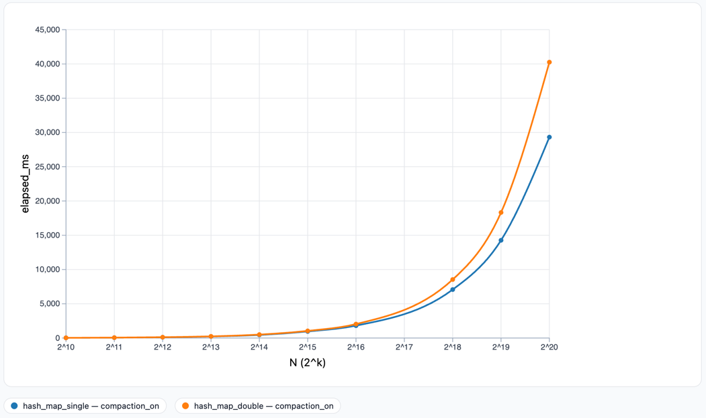
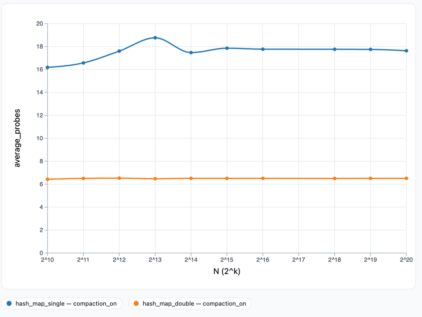

# LRU Hash Table Analysis Report

## 1. Dataset Summary

- Profile: lru_profile
- Trace files: 11 (N = 1024 to 1048576)
- Probe types tested: single, double
- Compaction: enabled (trigger = 0.95)
- Total data points: 22

## 2. Section 5.1: Timing Analysis

### 5.1.1 Expectations vs Observations

**Expected:**
My initial expectations are that double probing would be worse 
than single probing at small N. The extra computation required for
double probing seems like it would be more overhead than the benefit
of double probing. (Essentially, extra probing might happen with single probing
but still less overhead at small N).

At some point, I expect double probing to actually be worth it. So at large N I absolutely
expect double probing to outperform single probing (but what N will be interesting
to find out). This is due to double probing has a little more overhead, 
but less overall probes, I expect it to be faster. Since I fully expect double probing to overtake
single probing, at some point the data should intersect. I expect this intersection to occur at some
large N, likely somewhere near the middle of our actual data set (perhaps around 2^16).

**Observed:**
- Single probing at small N=1024: 25.155 ms
- Double probing at small N=1024: 32.942 ms
- Single probing at medium N=2^15: 1811 ms
- Double probing at medium N=2^15: 2038 ms
- Single probing at large N=2^20: 29,319 ms
- Double probing at large N=2^20: 40,258 ms

The data actually dramatically disagreed with my expectation! At least for a elapsed ms,
I thought that EVENTUALLY double probing would be better, but single probing was consistently
faster across all N. 

The N value where separation is largest is at N = 2^20 (the largest N we tested-which
makes me wonder if as N increases, so does the separation between single and double probing),
and the separation ratio is: 29,319/40,258 which is about 72%. That is, single probing takes
about 72% as long vs double probing (28% faster).

### 5.1.2 Work per Operation vs Wall-Clock Time

**Average probes comparison:**

The average probes for a double probe was approximately 6.5 across all N tested. However,
the single probes had faster elapsed times across all N tested. This tells me that the 
hashing costs of the double probing lost to caching. Furthermore, since average probes
of double probing was consistent, as well as the separation growing as N increased, 
if we were to continue to increase N, I would expect single probing to continue to outperform
double probing.

The ordering by average_probes and by time actually ALWAYS disagreed. Despite double probing
having less average probes **ALWAYS** it still performed slower than single probing. This is likely
due to the overhead of a second hashing function as well as single probing taking
advantage of caching. The compactions count is also higher for double probing across 
all N tested, which certainly contributes to overhead and the slower elapsed time.

### 5.1.3 Hashing Cost and Memory Locality
The per operation hashing costs differ in that, while single probing simply moves on to the 
next slot in the array, double probing must do ANOTHER hashing function and then jump around. As stated
earlier, caching is an advantage of single probing, and matters more and more as N increases. The reason
for this is that double probing jumps around which does not utilize caching very efficiently. However, for
small N, double probing can still take advantage of caching to some extent, and that is why
double probing starts close to single probing but then diverges from it as N increases. That is, the constant
factors matter the most at large N.

Another point of struggle for the double probing algorithm is that we are hashing strings, which
is expensive. For every expensive hashing operation that single probing does, double probing does 
two of them.

//TODO: Run the harness with some middle N value and answer the second question of this
section.

### 5.1.4 Compaction Effects (indirect inference)

Across all N tested, double probing triggered more compactions than single probing. Interestingly enough,
double probing triggered exactly 6 more compactions than single probing for all N tested.
## 3. Section 5.2: Structure Analysis

[To be completed with 0/1 maps]

## 4. Conclusions

[To be written]